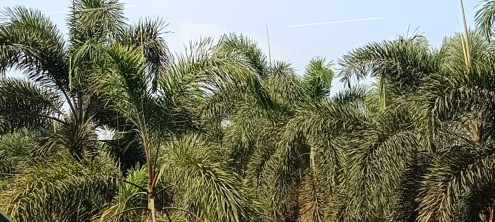
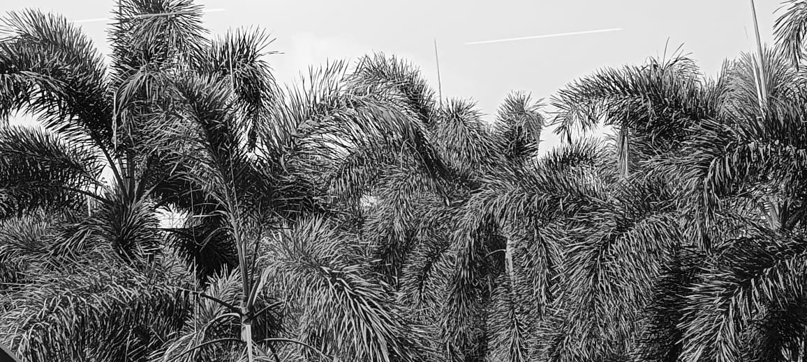
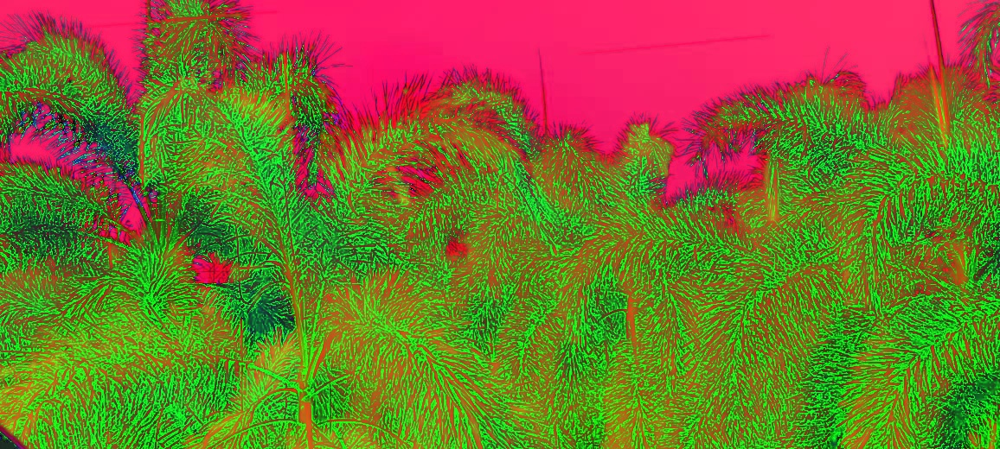
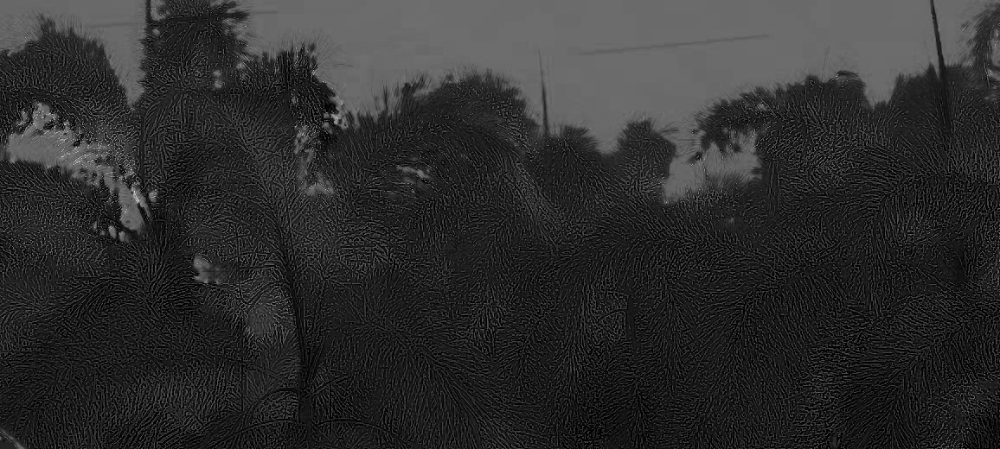
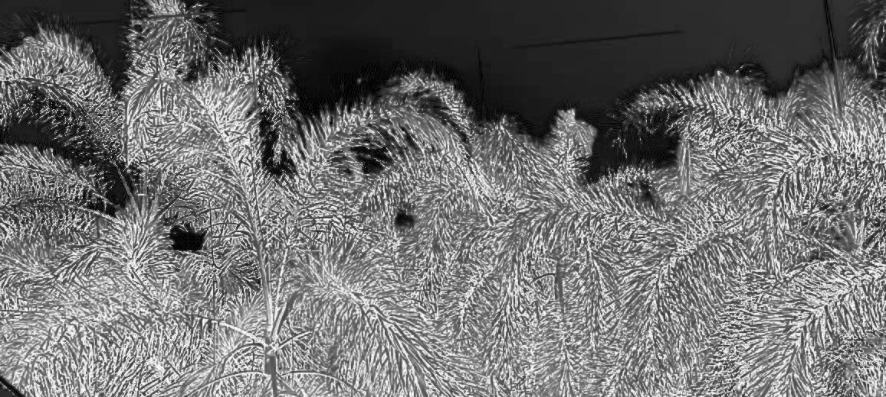

# Workshop1- Working on images
## Program:
### Developed by: ANISH RAJ P
### Register Number: 212222230010
```
import cv2
image = cv2.imread('Anish.jpg')
gray_image = cv2.cvtColor(image, cv2.COLOR_BGR2GRAY)
hsv_image = cv2.cvtColor(image, cv2.COLOR_BGR2HSV)
cv2.imwrite('GRAYSCALE.jpg', gray_image)
cv2.imwrite('HSV.jpg', hsv_image)

import cv2
hsv_image = cv2.imread('HSV.jpg')
h, s, v = cv2.split(hsv_image)
cv2.imwrite('Hue_plane.jpg', h)
cv2.imwrite('Saturation_plane.jpg', s)
cv2.imwrite('Value_plane.jpg', v)

```
## OUTPUT
### Original Image
 

### Grayscale Image


### HSV Image


### Hue Plane


### Saturation Plane


### Value Plane
